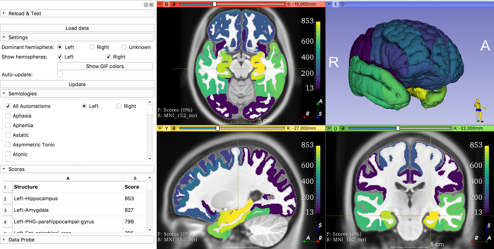

# mega_analysis

## Epilepsy Semiology Visualisation Tool

Figure:
849 Patients with automatisms have an epileptogenic zone localising mostly to the mesial temporal lobe.
124 of these lateralise, mainly ipsilaterally.

Thousands of patient-level semiology data-points (where 1 point corresponds to 1 patient, presenting a certain seizure semiology) were extracted from selected peer-reviewed journal publications, if at least one of the following ground-truth criteria to establish epileptogeniz zone's localisation and/ or lateralisation was satisfied:

* Post-operative seizure freedom (Engel Ia,b; ILAE 1,2), confirmed at a minimum follow-up of 12 months;
* Invasive EEG recording and/ or electrical stimulation, mapping seizure semiology;
* Multi-modal concordance between brain imaging & non-invasive neurophysiology findings (e.g. PET, SPECT, MEG, EEG, fMRI) in pointing towards a highly possible epileptogenic zone.

The data are also tagged to reduce publications bias and/or enhance data visualisation (e.g. of invasive EEG electrode targets) to allow filtering out specific paper/patient-level priors:

* Epilepsy Topology (ET): when the paper selects sample of patients based on their established epileptogenic zone and/or site of surgical resection (seizure onset zone), and describes the related seizure semiology - e.g. papers looking at mTLE, TLE, FLE, OLE;
* Spontaneous Semiology (SS): when paper selects sample of patients based on their siezure semiology (e.g. genital automatisms, nose-wiping, gelastic, ictal kissing), or other factors (specific techniques used, specific associated conditions like FCD etc.), and provides details of epileptogenic zone's localisation/lateralisation; 
* Electrical Stimulation (ES): when the paper describes the semiology elicited by electrical brain stimulation, in the context of pre-/ intra-surgical functional mapping;

## Brief workings:
In brief, this software cleans the DataFrame of data, pivots occurences of semiology, allowing for semiology_dictionary ontology replacement regex searches, maps the documented localisations to gif parcellations and can scale these mappings using different scalers/transformers.
Data can be filtered based on the above ground truth and journal priors.

## Branches
* Master branch - to be used with slicer module for 3D visualisation
  ** (merged from separate repo (https://github.com/fepegar/EpilepsySemiology))
* MegaAnalysis-March2020 branch - original verbose module for development and progress stats
  ** (thenineteen jupyter backwards compatibility)

## Installation Guide
1. Clone (or [download](https://github.com/thenineteen/Semiology-Visualisation-Tool/archive/master.zip) and extract) this repository
2. Download a [**Preview Release** of 3D Slicer](https://download.slicer.org/) (not the Stable version)
3. Install and open Slicer
4. Go to the menu `Edit` > `Application Settings` > `Modules` > `Additional module paths` > `Add` (you may have to click on the double arrows to the right of Additional Module Paths)
5. Click on the directory to which you cloned this repository > click on the `slicer` folder and click `Select Folder`
6. Click on `OK` and restart Slicer when prompted
7. To open the module, click on the magnifier and search for `Semiology`
8. You might need to restart Slicer again, if prompted
